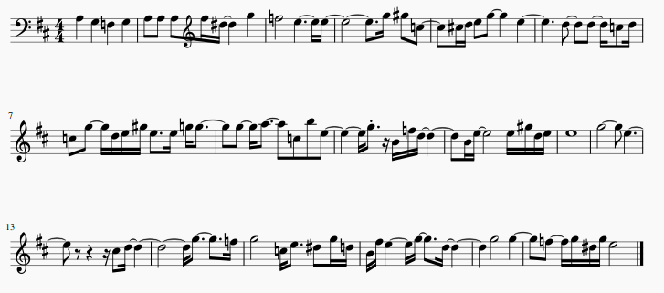

# Classical Music Generation

Model types include LSTM, CNN and Transformer.

Here is a snippet of score generated by one of the trained models.

### Requirements:

`absl-py==0.9.0` 
`astunparse==1.6.3` 
`cachetools==4.1.1` 
`certifi==2020.6.20` 
`chardet==3.0.4` 
`future==0.18.2` 
`gast==0.3.3` 
`google-auth==1.19.2` 
`google-auth-oauthlib==0.4.1` 
`google-pasta==0.2.0` 
`grpcio==1.30.0` 
`h5py==2.10.0` 
`idna==2.10` 
`importlib-metadata==1.7.0` 
`Keras-Preprocessing==1.1.2` 
`Markdown==3.2.2` 
`music21==5.7.2` 
`numpy==1.19.0` 
`oauthlib==3.1.0` 
`opt-einsum==3.2.1` 
`Pillow==7.2.0` 
`protobuf==3.12.2` 
`pyasn1==0.4.8` 
`pyasn1-modules==0.2.8` 
`requests==2.24.0` 
`requests-oauthlib==1.3.0` 
`rsa==4.6` 
`scipy==1.4.1` 
`six==1.15.0` 
`tensorboard==2.2.2` 
`tensorboard-plugin-wit==1.7.0` 
`tensorflow==2.2.0` 
`tensorflow-estimator==2.2.0` 
`termcolor==1.1.0` 
`torch==1.5.1+cpu` 
`torchvision==0.6.1+cpu` 
`tqdm==4.48.0` 
`urllib3==1.25.9` 
`Werkzeug==1.0.1` 
`wrapt==1.12.1` 
`zipp==3.1.0` 